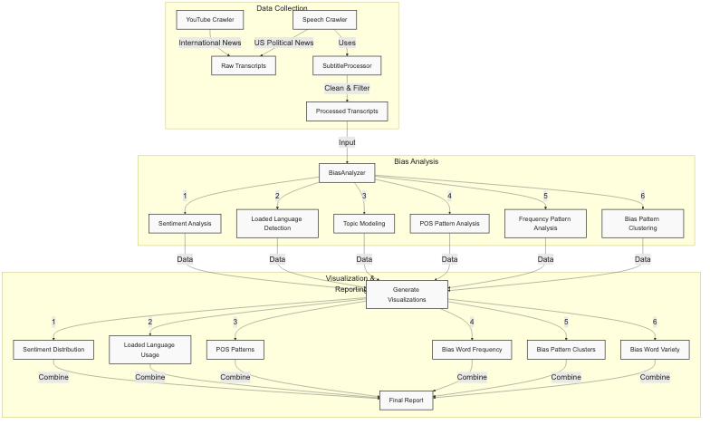

# News Media Bias Analysis

A comprehensive media bias analysis system that leverages advanced NLP techniques to analyze bias patterns in news media. The project combines data from international news sources (via YouTube) and US political news channels to provide a thorough analysis of media bias patterns.



## Project Overview

The system consists of three main components:
1. **Data Collection**: Dual crawler system for gathering diverse news sources
2. **Bias Analysis**: Six-dimensional analysis of media bias
3. **Visualization**: Comprehensive visualization suite for bias pattern interpretation

## Features

### Data Collection
- **YouTube Crawler**: International news sources (VOA, DW, etc.)
- **Speech Crawler**: US political news based on Harvard Media Bias Chart
- **SubtitleProcessor**: Advanced text cleaning and validation

### Analysis Pipeline
- **Sentiment Analysis**: Emotional tone measurement
- **Loaded Language**: Bias word detection and classification
- **Topic Modeling**: Theme identification using LDA
- **POS Analysis**: Linguistic pattern detection
- **Pattern Recognition**: GMM-based bias clustering

### Visualization Suite
- Interactive bias pattern visualizations
- Cross-channel comparison tools
- Temporal bias trend analysis

## Setup

1. Clone the repository:
```bash
git clone <repository-url>
cd <repository-name>
```

2. Install dependencies:
```bash
pip install -r requirements.txt
python -m spacy download en_core_web_sm
```

3. Set up YouTube API:
   - Go to [Google Cloud Console](https://console.cloud.google.com)
   - Create a new project
   - Enable the YouTube Data API v3
   - Create API credentials
   - Create a `.env` file in the project root and add your API key:
     ```
     YOUTUBE_API_KEY=your_api_key_here
     ```

## Usage

1. Crawl YouTube news channels:
```bash
python youtube_crawler.py
```
This will:
- Fetch videos from specified news channels
- Extract available transcripts
- Save the data to a CSV file

2. Analyze bias in the transcripts:
```bash
python bias_analyzer.py
```
This will:
- Perform sentiment analysis
- Detect loaded language
- Generate topic models
- Create visualizations
- Output a comprehensive bias report

## Analysis Components

### 1. Sentiment Distribution
- Boxplot visualization of emotional tone distribution
- Channel-wise sentiment comparison
- Temporal sentiment trend analysis

### 2. Loaded Language Analysis
- Positive/negative bias word tracking
- Emotional language density measurement
- Cross-channel bias word comparison

### 3. POS Pattern Analysis
- Adjective/adverb ratio analysis
- Subjective language detection
- Linguistic pattern identification

### 4. Bias Word Frequency
- Density mapping of biased language
- Channel-specific bias patterns
- Temporal frequency analysis

### 5. Bias Pattern Clustering
- GMM-based pattern identification
- Cross-channel bias type distribution
- Cluster visualization and analysis

### 6. Bias Word Variety
- Diversity measurement in biased language
- Channel-specific vocabulary analysis
- Comparative linguistic diversity study

## Outputs

### Data Files
- `transcripts/`: Raw transcript data by channel
- `processed_data/`: Cleaned and processed transcripts
- `analysis_results/`: Intermediate analysis results

### Visualizations
1. `sentiment_distribution.png`: Emotional tone boxplots
2. `loaded_language_usage.png`: Bias word comparisons
3. `pos_patterns.png`: Language pattern analysis
4. `bias_frequency.png`: Bias density maps
5. `bias_clusters.png`: Pattern clustering results
6. `bias_variety.png`: Language diversity analysis

### Reports
- `channel_analysis.pdf`: Per-channel detailed analysis
- `comparative_report.pdf`: Cross-channel comparison
- `trend_analysis.pdf`: Temporal bias patterns
- `executive_summary.pdf`: Key findings and insights

## Dependencies

### Core Libraries
- pandas>=1.5.0
- numpy>=1.21.0
- scikit-learn>=1.0.0

### NLP Tools
- spacy>=3.5.0
- textblob>=0.17.1
- transformers>=4.25.0
- torch>=1.13.0

### Data Collection
- youtube-dl>=2021.12.17
- youtube-transcript-api>=0.5.0
- python-dotenv>=0.21.0

### Visualization
- matplotlib>=3.6.0
- seaborn>=0.12.0
- plotly>=5.11.0

### Development Tools
- pytest>=7.0.0
- black>=22.0.0
- flake8>=6.0.0

## Notes

- Some videos may not have available transcripts
- Analysis results should be interpreted in context
- Bias detection is based on predefined metrics and may not capture all forms of media bias

## Contributing

Feel free to:
- Report issues
- Submit pull requests
- Suggest improvements to bias detection algorithms
- Add new analysis features
